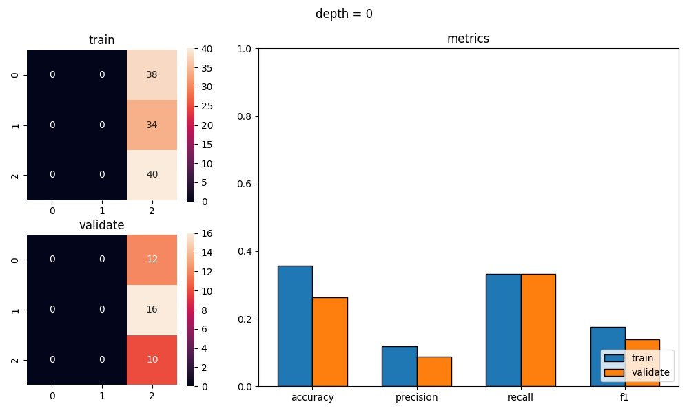
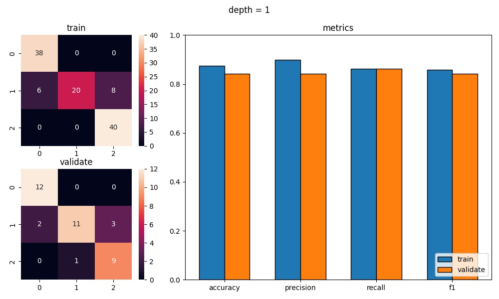
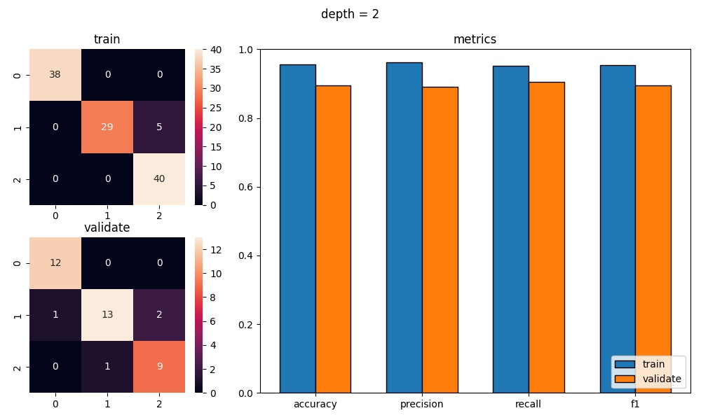
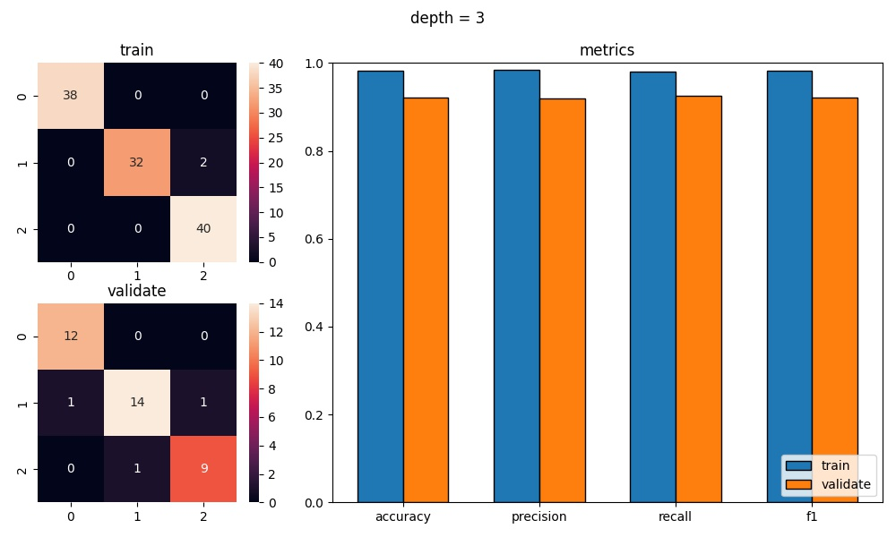
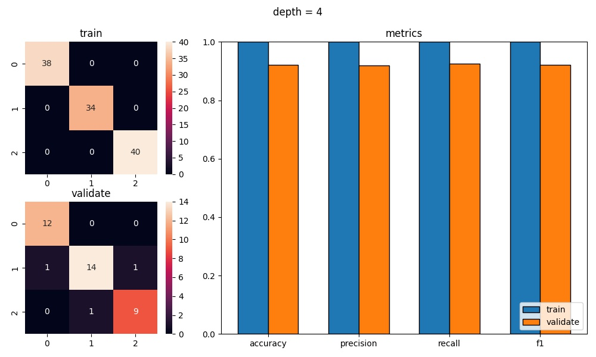

<h1 style="text-align: center;">

Jakub Ostrzołek

WSI ćwiczenie 4 - drzewo ID3

</h1>

## Opis ćwiczenia
Celem ćwiczenia było zaimplementowanie drzewa decyzyjnego ID3. 

Klasa implementująca drzewo ma jeden parametr konstruktora:
* `max_depth` - maksymalna wysokość drzewa powstałego w wyniku uczenia się

Klasa ta ma 2 główne funkcje (zgodne z biblioteką sklearn):
* `fit` - uczenie drzewa na podstawie danych wejściowych i przypisanych im klas wyjściowych
* `predict` - przewidywanie klas dla danych wejściowych (wcześniej nauczyonych przez `fit`)

## Wykorzystane zewnętrzne biblioteki
* `numpy`
* `pandas`
* `matplotlib`
* `sklearn`
 
## Wykresy
Aby wygenerować wykresy, należy wykonać skrypt `plot.py`. Za pomocą skryptu można wygenerować:
* macierze konfuzji dla wybranych zbiorów danych
* porównanie metryk dla wybranych zbiorów danych

Oto przykładowe wyniki:

## Wnioski

