

<h1 style="text-align: center;">

Jakub Ostrzołek

WSI ćwiczenie 6 - Q-Learning

</h1>

## Opis ćwiczenia
Celem ćwiczenia było zaimplementowanie algorytmu Q-Learning.

Klasa implementująca agenta wykorzystującego algorytm Q-Learning ma następujące parametry konstruktora:
* `n_states` - ilość różnych stanów środowiska
* `n_actions` - ilość możliwych akcji agenta
* `discount` - dyskont
* `learning_rate` - siła uczenia się

Klasa posiada następujące metody:
* `decide_epsilon` - wybierz ruch dla danego stanu za pomocą metody $\epsilon$-zachłannej
* `decide_boltzmann` - wybierz ruch dla danego stanu za pomocą metody Boltzmanna
* `update_q` - zaktualizuj funkcję wartości-akcji na podstawie nagrody przydzielonej za wykonany ruch

## Wykorzystane zewnętrzne biblioteki
* `numpy`
* `matplotlib`

## Testowanie sieci
Aby przetestować agenta należy wykonać skrypt `main.py`, uprzednio zmieniając jego parametry zgodnie z zapotrzebowaniem.  
Skrypt wygeneruje nowego agenta i będzie go uczył przez zadaną ilość epizodów, wyświetlając okresowo jego postępy (średnią nagrodę za ostatni ruch i jej odchylenie standardowe oraz mapę najlepszych ruchów).  
Parametr `exploration` (podawany do funkcji `decide_xxx`) będzie zmieniany w czasie przez skrypt w sposób wykładniczy, zbiegający do zadanej wartości z zadaną szybkością. Jego wartość będzie aktualizowana przed każdym nowym epizodem.

## Wykresy i wnioski
Wszystkie wykresy ukazują zależność średniej nagrody ostatnich 1000 epizodów od numeru epizodu (liczbę epizodów braną pod uwagę można ustawić parametrem `PLOT_LOOKBEHIND`). 

### Exploration lambda
Parametr ten wyznacza szybkość wykładniczego zmniejszania wartości `exploration` między epizodami.

| `EXPLORATION LAMBDA` | wykres                            |
| -------------------- | --------------------------------- |
| 0,005                | 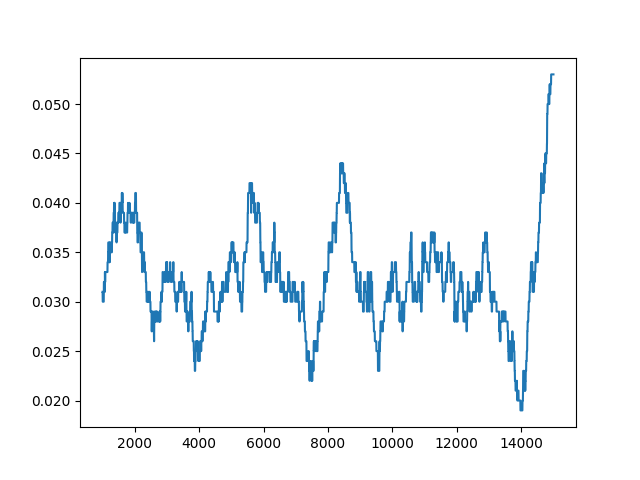 |
| 0,001                | 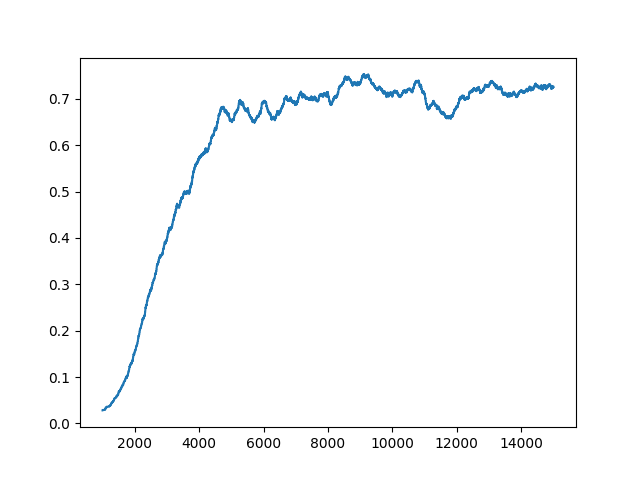 |
| 0,0005               | 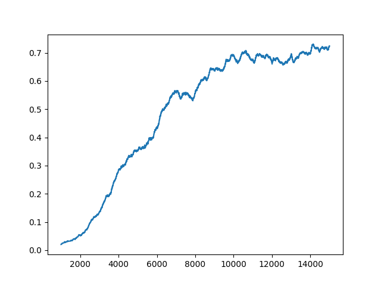 |
| 0,00025              | 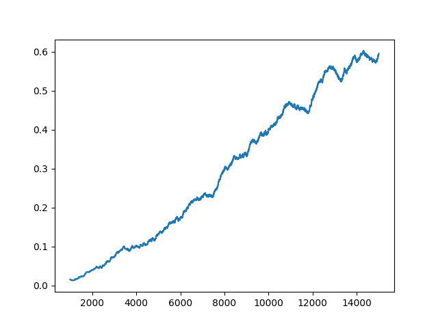 |

* im większy ten parametr, tym szybciej agent się uczy, a wykres szybciej się wygładza (do pewnego momentu)
* zbyt duża wartość tego parametru sprawia, że agent nie potrafi w wyznaczonej liczbie epizodów dobrze się wytrenować, ponieważ zmiany jego funkcji wartości-akcji stają się zbyt małe, zanim jest w stanie znaleźć optymalną strategię
* parametr ten kontroluje punkt zmiany skupienia agenta - z eksploracji na eksploatację.

### Learning rate
Parametr ten wyznacza siłę zmian wprowadzanych do funkcji wartości-akcji przy jej aktualizacji po wykonaniu kroku. W oryginalnym algorytmie Q-Learning może się on również zmieniać w czasie, jedak testy pokazały, że manipulacja samym parametrem `exploration` jest (w przypadku tego problemu) lepsza i wystarczająca.

| `LEARNING RATE` | wykres                                   |
| --------------- | ---------------------------------------- |
| 0,5             | 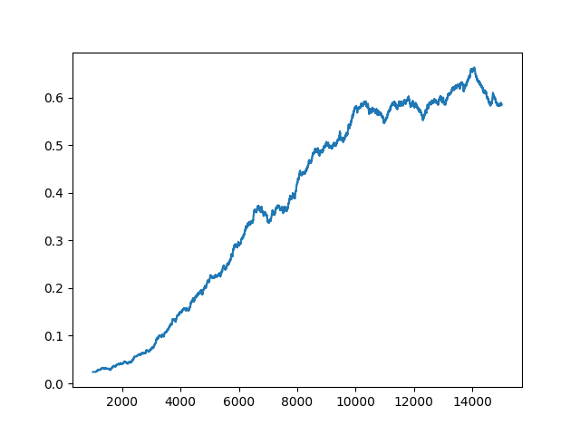 |
| 0,3             | 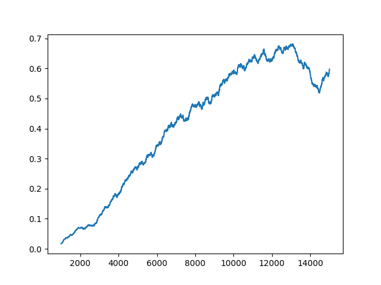 |
| 0,1             | 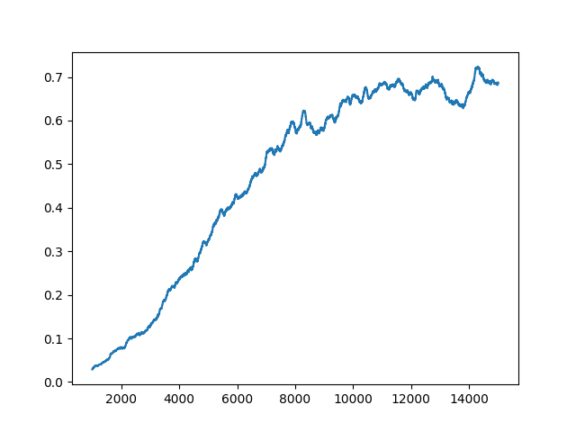 |
| 0,05            | 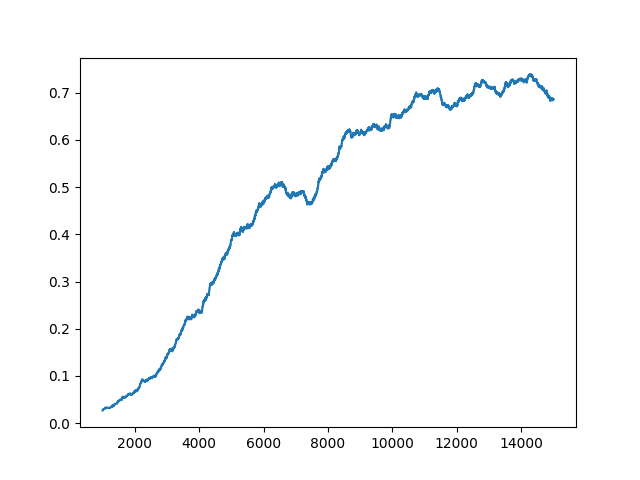 |
| 0,025           | 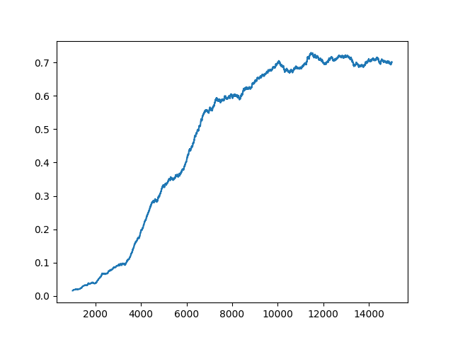 |
| 0,010           | 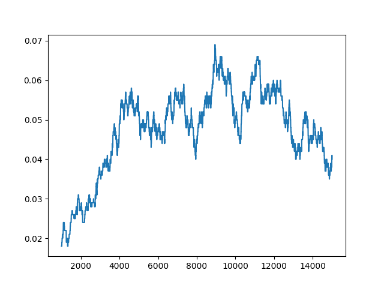 |

* parametr ten nie zmienia drastycznie osiągów agenta
* ustawienie go zbyt nisko przypomina sytuację, gdy parametr `EXPLORATION_LAMBDA` był ustawiony zbyt wysoko. Wyjaśnienie jest to samo - agent jest 'zmuszany' do zaprzestania eksploracji pomimo, że nie znalazł jeszcze optymalnej strategii
* ustawienie go zbyt wysoko nieznacznie obniża osiągi agenta.

### Discount
Parametr ten wyznacza 'dalekowzroczność' agenta. Im większy on jest, tym więcej kroków w przód agent będzie w stanie wziąć pod uwagę.

| `DISCOUNT` | wykres                             |
| ---------- | ---------------------------------- |
| 1,00       | 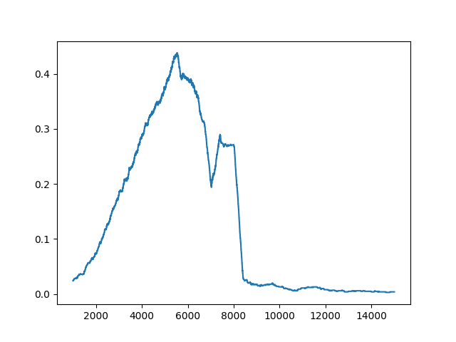 |
| 0,95       | 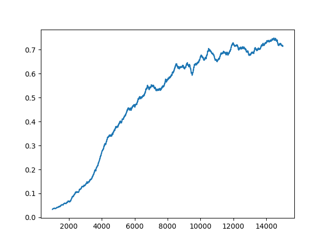 |
| 0,90       | 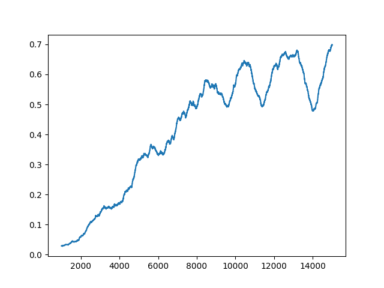 |
| 0,80       | 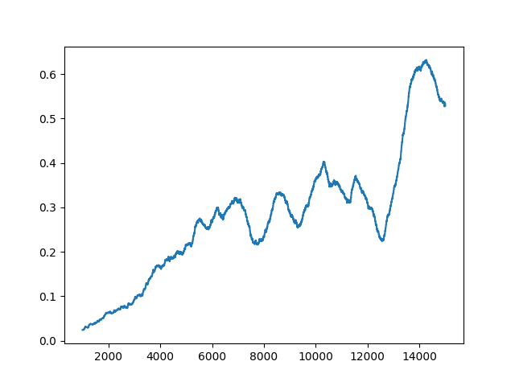 |

* parametr jest czuły na zmiany
* ustawienie go zbyt nisko powoduje dużą nieregularność w osiągach agenta - zmiana w funkcji wartości-akcji w jednym miejscu szybko pociąga za sobą zmiany w poprzedzających je akcjach
* ustawienie go na wartość 1 powoduje, że każda zmiana funkcji wartości-akcji propaguje w nieskończoność, do każdego poprawnego stanu, przez co w pewnym momencie informacje się nazwajem zacierają.

