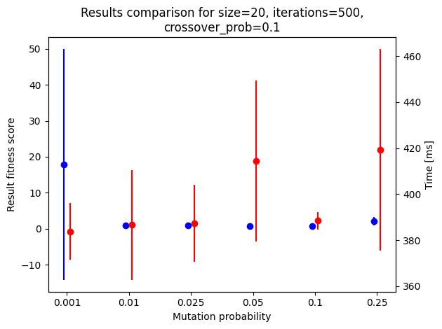
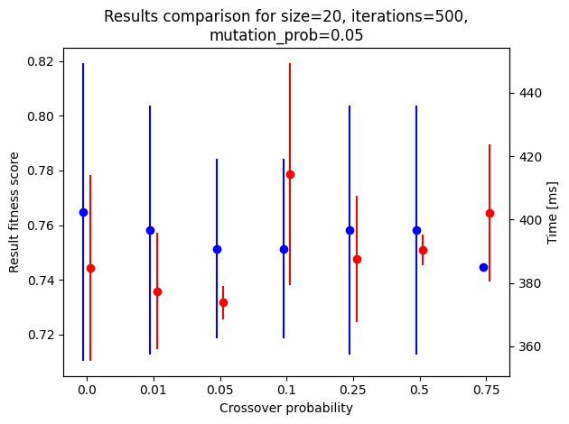
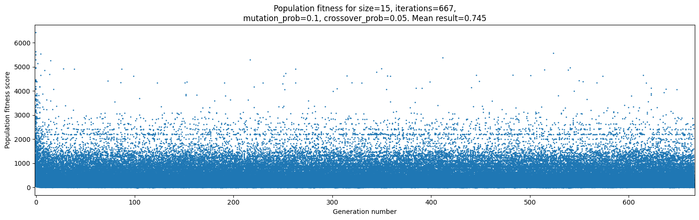
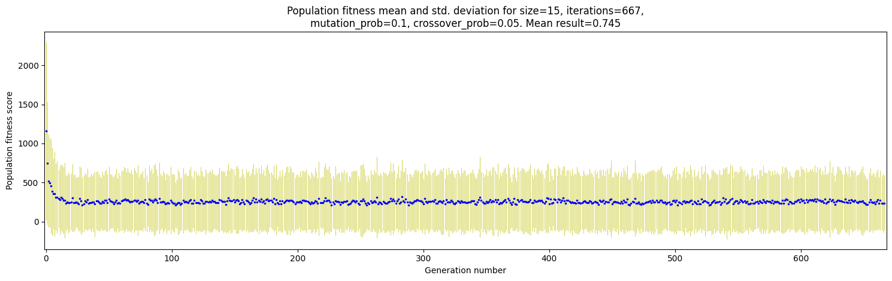

<h1 style="text-align: center;">

Jakub Ostrzołek

WSI ćwiczenie 2 - algorytm genetyczny

</h1>

## Opis ćwiczenia
Celem ćwiczenia było zaimplementowanie algorytmu genetycznego Hollanda oraz użycie go w problemie poszukiwania minimum dla funkcji czterech zmiennych.

Funkcja implementująca algorytm przyjmuje następujące główne argumenty:
* `fitness_fnc` - funkcja oceny (musi przyjmować jako argument jednego osobnika - wektor wartości boolowskich)
* `population` - populacja początkowych osobników
* `iterations` - liczba iteracji, po której algorytm ma zakończyć działanie
* `mutation_prob` - szansa, że dany gen w osobniku ulegnie mutacji
* `crossover_prob` - szansa, że para osobników ulegnie krzyżowaniu

Funkcja zwraca krotkę `(ocena, osobnik)`, która reprezentuje najlepsze rozwiązanie, lub, po ustawieniu argumentu `return_generations=True`, listę obiektów klasy `Generation`, reprezentujących stan populacji w kolejnych iteracjach przebiegu algorytmu.

## Wykorzystane zewnętrzne biblioteki
* `numpy`
* `matplotlib`
* `pytest`
* `pytest-benchmark`

## Użycie
Aby użyć algorytmu dla wybranych parametrów algorytmu należy uruchomić skrypt `main.py` i postępować zgodnie z instrukcjami (`main.py --help`).

## Testowanie
Przetestowana została jedynie część algorytmiczna ćwiczenia. Aby uruchomić testy należy wpisać komendę `pytest --benchmark-skip` lub `pytest test_genetic.py` (aby nie wykonywać czasochłonnej oceny).

## Ocena parametrów algorytmu
**Aby szybko dokonać oceny i wygenerować wykresy użyte w tej dokumentacji należy uruchomić skrypt bashowy `plots.sh`**  

Ocenę należy uruchomić komendą `pytest --benchmark-json=<ścieżka_do_pliku_z_oceną>.json`. Można zmieniać oceniane zbiory parametrów zmieniając wartości stałych `SIZES_ITERATIONS` (skumulowane `sizes` i `iterations`, ponieważ $`sizes * iterations = const`$ aby przebiegi algorytmu miały równą ilość wszystkich wygenerowanych osobników), `MUTATION_PROBS`, `CROSSOVER_PROBS`. Aby ograniczyć liczbę wykonywanych testów, zamiast oceniania każdej kombinacji parametrów algorytmu, są testowane kolejno parametry o wartościach pochodzących z wyżej wymienionych stałych, a reszta parametrów pochodzi ze stałej `STD_PARAMS`. Dodatkowo jest jeszcze stała `SEPARATE_PARAMS`, służąca do dodania osobnych zestawów parametrów. 
Można również regulować ilość powtórzeń stałą `REPEAT`.
 
## Analiza
Aby poddać wyniki analizie, należy wykonać skrypt `analyze.py` i postępować zgodnie z instrukcjami (`analyze.py --help`). Za pomocą skryptu można wygenerować:
* wykresy zależności oceny rozwiązań populacji od numeru iteracji algorytmu (`plot_type=scatter`); większe punkty na wykresie oznaczają więcej osobników o dokładnie tej samej ocenie (ten typ wykresu staje się mało czytelny dla dużej liczby iteracji, powtórzeń i rozmiaru populacji),
* wykresy zależności średniej oceny rozwiązań populacji wraz z odchyleniem standardowym reprezentowanym poprzez słupek błędu od numeru iteracji algorytmu (`plot_type=mean-std`) (ten typ wykresu staje się mało czytelny dla dużej liczby iteracji),
* wykresy porównujące wydajność algorytmu w zależności od zmieniającego się jednego parametru algorytmu przy stałej reszcie (`plot_type=compare`).

Typ wykresu `scatter` oraz `mean-std` biorą pod uwagę skumulowane populacje z wszystkich powtórzeń.  

Oto przykładowe wyniki:

* Ocena kolejnych populacji (wydaje się, że ocena przyjmuje tu ujemne wartości, jednak jest to spowodowane tym, że rozmiar punktu rośnie wraz z ilością identycznych punktów):  

* Średnia ocena i odchylenie standardowe kolejnych populacji:  

* Porównanie wydajności algorytmu dla różnych wartości rozmiaru populacji i ilości iteracji (tak, żeby $`size * iterations = const`$):  

* Porównanie wydajności algorytmu dla różnych wartości szansy na mutację:  

* Porównanie wydajności algorytmu dla różnych wartości szansy na krzyżowanie:  

## Wnioski
Z wykresów porównujących można wywnioskować, że:
* dysponując "budżetem" łącznej liczby wygenerowanych przez algorytm osobników ($`size * iterations`$), warto dobrze pomyśleć nad rozdysponowaniem tego budżetu na parametry rozmiaru populacji i liczby iteracji. Przesada w obie strony skutkuje obniżeniem osiągów algorytmu. Optymalna wartość w tym przypadku leży gdzieś w okolicy $`(15, 667)`$
* zarówno za duża jak i za mała szansa na mutację wpływa negatywnie na rozwiązanie. Najlepsza wartość wydaje się być w pobliżu $`0.1`$.
* szansa na krzyżowanie nie wpływa znacząco na wynik algorytmu. Dodatkowo za każdym razem, gdy generuję ten wykres, wygląda on inaczej. Przyjąłem wartość tego parametru dla rozwiązania równą $`0.05`$.

Wobec tego najlepsze parametry dla algorytmu mieszczą się w okolicach:
* `size=15`
* `iterations=667`
* `mutation_prob=0.1`
* `crossover_prob=0.05`

Wykresy typu `scatter` i `mean-std` dla tak dobranych parametrów:

Dla porównania zbiór parametrów wybranych przeze mnie "na wyczucie" (użyty jako `STD_PARAMS` w `test_benchmark.py`):

Udało się (co prawda bardzo niewiele) obniżyć średnią ocenę wyniku dla paremtrów dobranych eksperymentalnie.  
Na wykresach typu `scater` można zauważyć, że w I przypadku osobniki bardziej równomiernie pokrywają wykres - może to oznaczać, że bardziej "odrywają" się od swoich grup w poszukiwaniu lepszych minimów. Przypuszczenie to potwierdza również wyższa wartość odchylenia standardowego, widoczna na wykresie typu `mean-std`.  
W II przypadku osobniki zapewnie czasami znajdują sub-optymalne minimum i mają zbyt słabą eksplorację, by się z niego wydostać.

