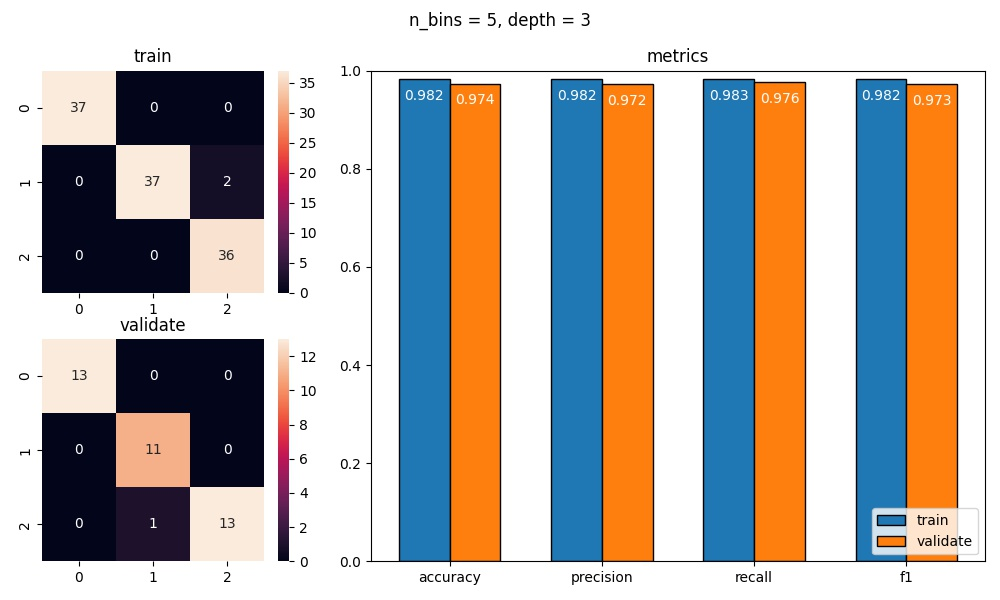

<h1 style="text-align: center;">

Jakub Ostrzołek

WSI ćwiczenie 4 - drzewo ID3

</h1>

## Opis ćwiczenia
Celem ćwiczenia było zaimplementowanie drzewa decyzyjnego ID3. 

Klasa implementująca drzewo ma jeden parametr konstruktora:
* `max_depth` - maksymalna wysokość drzewa powstałego w wyniku uczenia się.

Klasa ta ma 2 główne funkcje (zgodne z biblioteką sklearn):
* `fit` - uczenie drzewa na podstawie danych wejściowych i przypisanych im klas wyjściowych,
* `predict` - przewidywanie klas dla danych wejściowych (wcześniej nauczyonych przez `fit`).

## Wykorzystane zewnętrzne biblioteki
* `numpy`
* `pandas`
* `matplotlib`
* `sklearn`
 
## Wykresy
Aby wygenerować wykresy, należy wykonać skrypt `plot.py`. Za pomocą skryptu można wygenerować:
* macierze konfuzji dla wybranych zbiorów danych
* porównanie metryk dla wybranych zbiorów danych
* powyższe wykresy dla najlepszej kombinacji hiperparametrów (pod względem sumy metryk)

Każdy wykres jest opisany dwoma hiperparametrami:
* `depth` - maksymalna głębokość drzewa
* `n_bins` - "rozdzielczość" dyskretyzacji danych wejściowych (dane wejściowe są grupowane w klasy tak, by w każdej klasie była porównywalna ilość rekordów)

Oto przykładowe wyniki:
* `n_bins = 5` - różne maksymalne głębokości drzewa

* `depth = 5` - różne "rozdzielczości" dyskretyzacji danych

## Wnioski
* Drzewo o maksymalnej głębokości 0 po prostu wybiera najczęściej występującą klasę w zbiorze trenującym. Jak można się spodziewać nie daje to zadowalających rezultatów.
* W tym przypadku nie widać zjawiska przeuczenia drzewa dla większych głębokości. Może to być związane z niewielkim wymiarem danych wejściowych (testowanie większych głębokości niż 4 nie ma sensu, bo i tak nie ma wystarczająco parametrów w zbiorze danych wejściowych).
* Natomiast widać zjawisko przeuczenia i niedouczenia dla skrajnych "rozdzielczości" dyskretyzacji danych. Z wykresów widać, że dla `n_bins = 5` (lub czasami 3, zależy od rozlosowania zbiorów) występują najlepsze metryki, a dla mniejszych i większych wartości tego parametru metryki stają się gorsze.

Wyniki na zbiorze testowym dla drzewa o najlepszych hiperparametrach:

