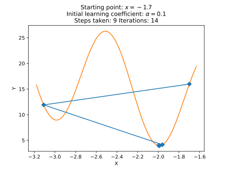

<h1 style="text-align: center;">

Jakub Ostrzołek

WSI ćwiczenie 1 - algorytm gradientu prostego

</h1>

## Opis ćwiczenia
Celem ćwiczenia było zaimplementowanie algorytmu wyznaczającego minimum lokalne funkcji za pomocą metody gradientu prostego (gradient descend).

Funkcja implementująca algorytm przyjmuje następujące główne argumenty:
* `fnc` - funkcja, której minimum ma znaleźć,
* `grad` - gradient tej funkcji,
* `start_pnt` - punkt początkowy,
* `learn_coef` - początkowy współczynnik uczenia się.

Funkcja zwraca obiekt klasy `Minimum`, który zawiera punkt i wartość minimum oraz pola do analizy wydajności algorytmu.

## Użycie
Aby użyć algorytmu dla wybranych punktów startowych należy wykonać skrypt `main.py` i postępować zgodnie z instrukcjami.

## Testowanie
Do testowania użyta została bilbioteka `pytest` oraz `pytest-benchmark`.  
Dla każdej funkcji wybieranych jest kilka początkowych punktów oraz wartości współczynnika uczenia się. Następnie algorytm jest wykonywany dla tych parametrów oraz generowany jest plik formatu JSON z wynikami. Widnieją tu m. in. po kroki wykonywane przez algorytm, liczba iteracji potrzebna na wykonanie się danego przykładu czy czas jaki zajęła praca funkcji. Dla każdego wykonania algorytmu sprawdzana jest długość wektora gradientu w zwróconym punkcie. Jeżeli jest ona bliska 0, to znaczy, że minimum zostało poprawnie odnalezione. 
 
## Analiza
Aby poddać wyniki analizie, należy wykonać skrypt `plots.py` i postępować zgodnie z instrukcjami. Za pomocą skryptu można wygenerować:
* wykresy funkcji z zaznaczonymi kolejnymi krokami algorytmu,
* wykresy porównujące wydajność algorytmu w zależności od zmieniającego się początkowego współczynnika uczenia się przy stałym punkcie początkowym,
* wykresy porównujące wydajność algorytmu w zależności od zmieniającego się początkowego punktu przy stałym początkowym współczynniku uczenia się.

Oto przykładowe wyniki:

* Kroki dla funkcji $`f`$  

,a=0.1.svg)
* Kroki dla funkcji $`g`$  

* Wydajność dla funkcji $`f`$ w zależności od początkowego współczynnika uczenia się  

.svg)
* Wydajność dla funkcji $`f`$ w zależności od punktu początkowego  

* Wydajność dla funkcji $`g`$ w zależności od początkowego współczynnika uczenia się  

* Wydajność dla funkcji $`g`$ w zależności od punktu początkowego  

## Wnioski
Z wykresów widać, że większy wpływ na wydajność algorytmu ma dobranie odpowiedniego początkowego współczynnika uczenia się, przy czym dla funkcji $`f`$ zależność ta wygląda odwrotnie niż dla funkcji $`g`$.  
* Funkcji $`f`$ raczej pomaga większy współczynnik uczenia się, a funkcji $`g`$ przeszkadza. Może to być spowodowane tym, że dla $`f`$ algorytm zawsze ma jasno określony kierunek - jest tylko jedno minimum, za to dla funkcji $`g`$ skok o zbyt dużą wartość będzie oznaczał znalezienie się w pobliżu innego lokalnego minimum, co tylko niepotrzebnie zwiększa liczbę iteracji algorytmu, a nie zbliża do otrzymania wyniku.  
Co ciekawe, dla funkcji $`f`$ możemy zobaczyć, że dla początkowego współczynnika uczenia się równego $`\alpha=0.5`$, minimum zostaje znalezione w jednej iteracji dla każdego punktu początkowego (oprócz $`(0,0)`$). Wynika to z faktu, że gradient tej funkcji wynosi $`\begin{bmatrix} 2x_1 \\ 2x_2 \end{bmatrix}`$, co oznacza, że po przemnożeniu go przez 0,5 i odjęciu od downolnego $`(x_1, x_2)`$ otrzymamy $`(0, 0)`$, co jest minimem funkcji. Podobny efekt widać dla $`\alpha=1`$, bo algorytm dzieli współczynnik uczenia się na pół w momencie, gdy wartość funkcji w następnym kroku byłaby nie mniejsza niż obecna wartość.  
* Dla $`f`$ oddalanie się od $`(0,0)`$ nieznacznie wydłuża działanie algorytmu, a dla $`g`$ punkt początkowy praktycznie nie ma znaczenia. Wynika to z faktu, że lokalne minima $`g`$ występują okresowo, co 1 jednostkę.

