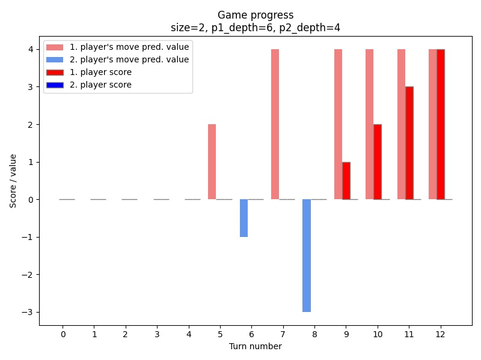
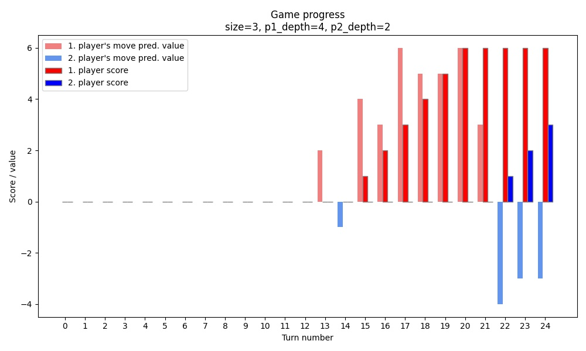
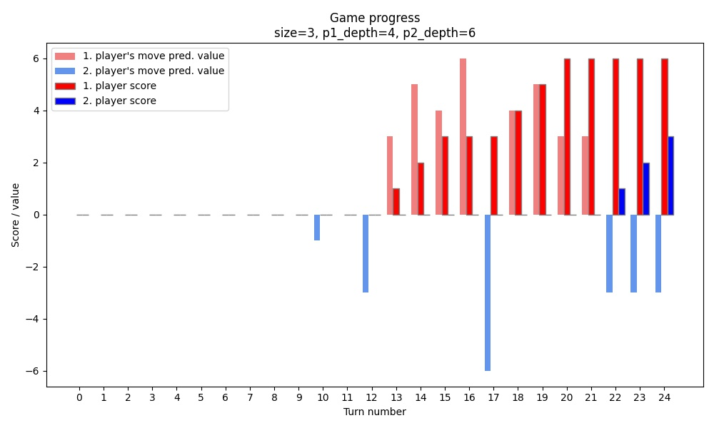
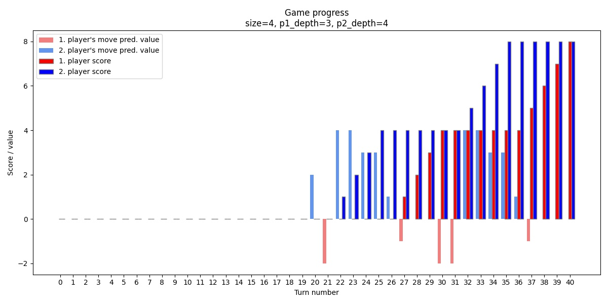
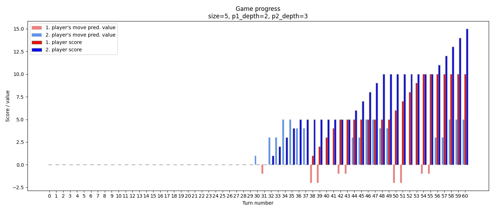
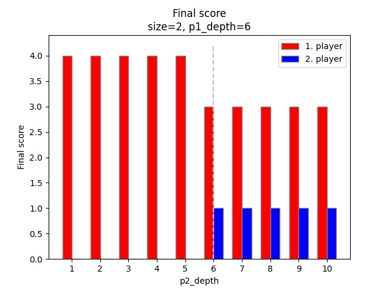
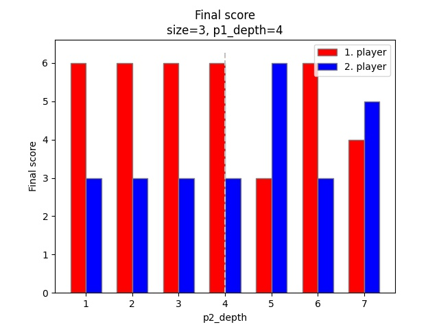
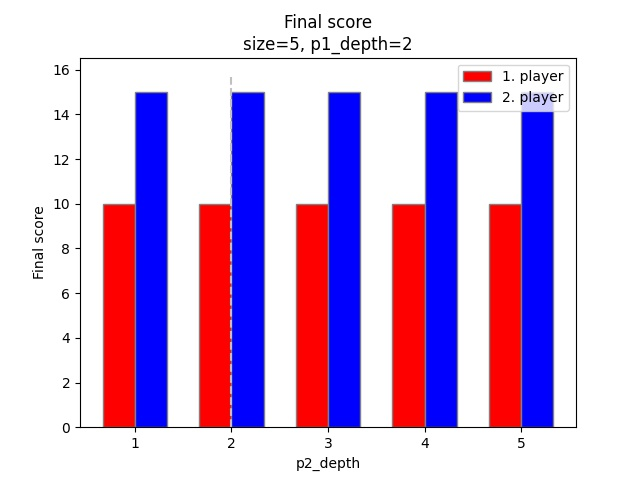
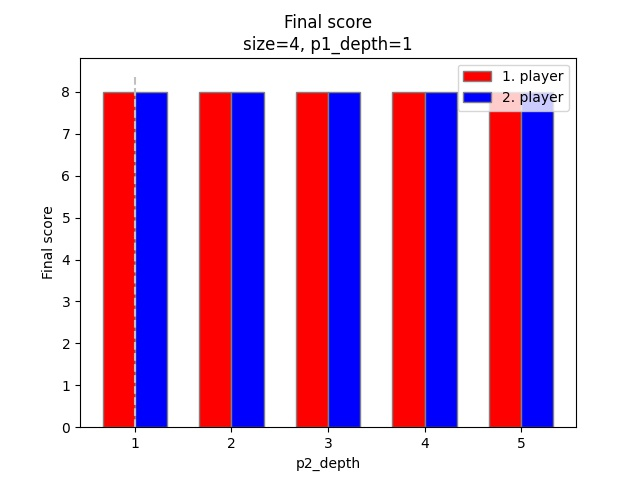

<h1 style="text-align: center;">

Jakub Ostrzołek

WSI ćwiczenie 3 - algorytm minimax z obcinaniem alpha - beta

</h1>

## Opis ćwiczenia
Celem ćwiczenia było zaimplementowanie algorytmu minimax z obcinaniem alpha - beta oraz przetestowanie go na [implementacji gry dots and boxes](https://github.com/lychanl/two-player-games).

Funkcja implementująca algorytm przyjmuje następujące główne argumenty:
* `state` - stan gry, na podstawie którego wybierany jest następny ruch obecnego gracza
* `depth` - głębokość przeszukiwania drzewa stanów gry
* `evaluate_state` - funkcja ewaluująca stan gry (dodatnie wartości oznaczają przewagę gracza max, ujemne - min)
* `max_player` - wybór gracza max

Funkcja zwraca krotkę `(ocena, ruch)`, która reprezentuje najlepsze rozwiązanie dla gracza max.

## Wykorzystane zewnętrzne biblioteki
* `numpy`
* `matplotlib`
* `pytest`
* `pytest-benchmark`

## Użycie
Aby użyć algorytmu dla wybranych parametrów algorytmu należy uruchomić skrypt `main.py` i postępować zgodnie z instrukcjami (`main.py --help`).

## Przeprowadzenie rozgrywek
Rozgrywki należy uruchomić komendą `pytest --benchmark-json=benchmark.json`.
 
## Wykresy
Aby wygenerować wykresy, należy wykonać skrypt `plot.py`. Za pomocą skryptu można wygenerować:
* wykresy przebiegu jednej rozgrywki z oznaczonymi ocenami ruchów graczy oraz ich punktami w każdej turze gry
* wykresy porównujące końcowe wyniki pierwszego gracza i drugiego gracza w zależności od zmieniającej się głębokości przeszukiwania drugiego gracza, przy stałym rozmiarze planszy i głębokości przeszukiwania pierwszego gracza.

Oto przykładowe wyniki:

* Przebiegi rozgrywek:  

* Porównania:  

## Wnioski
Z wykresów przebiegu rozgrywki można zauważyć, że:
* przez ok. połowę gry gracze nie są w stane przewidzieć dobrych ruchów, wybierają ruchy w których nie stracą w bezpośredni sposób punktów, w wyniku czego wyniki utrzymują się przy zerze. Gracze 'boją się' wykonać ryzykowny ruch, który może opłacić się później, bo nie potrafią przwidzieć tak dalekiej przyszłości.
* w pewnym momencie jeden z graczy znajduje dobrą strategię wygrywającą, lub 'orientuje się', że prawdopodobnie jest na przegranej pozycji. Zazwyczaj ten stan rzeczy utrzymuje się do końca - wygrywający wygrywa, a przegrywający przegrywa.
* zazwyczaj jako pierwszy jest w stanie ocenić swój ruch na wartość różną od 0 gracz o większej głębokości przeszukiwania, jednak nie zawsze oznacza to, że on właśnie wygra.
* gracze bardzo często zdobywają wiele punktów z rzędu - prowadzi to do "schodkowgo" wyglądu wykresów. Im większy `size`, tym bardziej jest to widoczne.

Z wykresów porównujących można wywnioskować, że:
* `size=2`:
  * pierwszy gracz ma dużą przewagę - wygrywa nawet, gdy drugi głębiej przeszkuje graf stanów
* `size=3`:
  * pierwszy gracz ma lekką przewagę - gdy drugi gracz głębiej przeszukuje graf stanów od pierwszego, ma szansę go pokonać
* `size=4`:
  * głębokość przeszukiwania ma mały wpływ na wynik rozgrywki - dla wybranych przeze mnie wartości mecz zawsze kończy się remisem. Niestety nie mogłem sobie pozwolić na ustawianie większego `p2_depth` niż 5, bo zbyt długo wykonywałby się benchmark (dla `p2_depth=5` już wykonywał się ponad 1 minutę, a cały benchmark 37 minut). Natomiast mogłem zmniejszyć `p1_depth`. Jak widać na poniższym wykresie dalej utrzymuje się ten sam wynik meczu:

* `size=5`
  * podobnie jak w przypadku `size=4` - nie widać wpływu `p2_depth` na wynik rozgrywki, nawet dla mniejszego `p1_depth`:

Gdy obejrzymy przebieg przykładowej rogrywki dla dużych `size`, od razu widać powód równych wynków niezależnie od wartości `p2_depth` oraz powód "schodkowych" wykresów.

  

Gracze na początku zapełniają planszę poziomymi kreskami, a następnie zdobywają punkty, kładąc pionowe linie - stąd "schodki" - zdobywają punkty za cały rząd kwadratów na raz, a następnie oddają kolejny rząd przeciwnikowi (nie mają innego wyboru).  
Równe wyniki można wyjaśnić tym, że po zapełnieniu planszy poziomymi kreskami, tak na prawdę nie ma znaczenia gdzie następny gracz położy swoją kreskę. Od tego momentu gra może mieć tylko dwa rozstrzygnięcia:
* jeżeli `size` jest parzyste - remis
* jeżeli `size` jest nieparzyste - wygra gracz, który jako pierwszy zdobędzie punkty za zapełnienie jednego rzędu. Dokładniej:
  * dla `size=4n+1` wygra gracz 2.
  * dla `size=4n+3` wygra gracz 1.

Aby zapobiec tego typu zachowaniom, należałoby znacznie zwiększyć głębokość przeszukiwania grafów stanów dla graczy, dzięki czemu mogliby zareagować przed wystąpieniem "punktu bez powrotu" - czyli zapełnieniem wszystkich miejsc na poziome kreski. Niestety zwiększenie głębokości przeszukiwania wiąże się z wykładniczym wzrostem ilości wykonywanych obliczeń, co szybko prowadzi do ekstremalnie długich czasów przebiegu gry.

