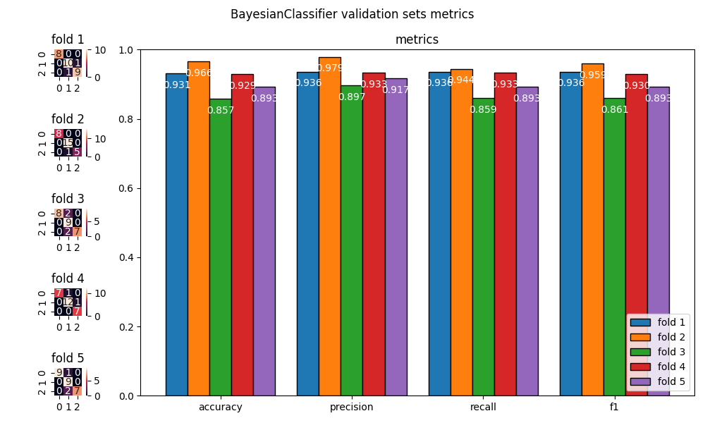
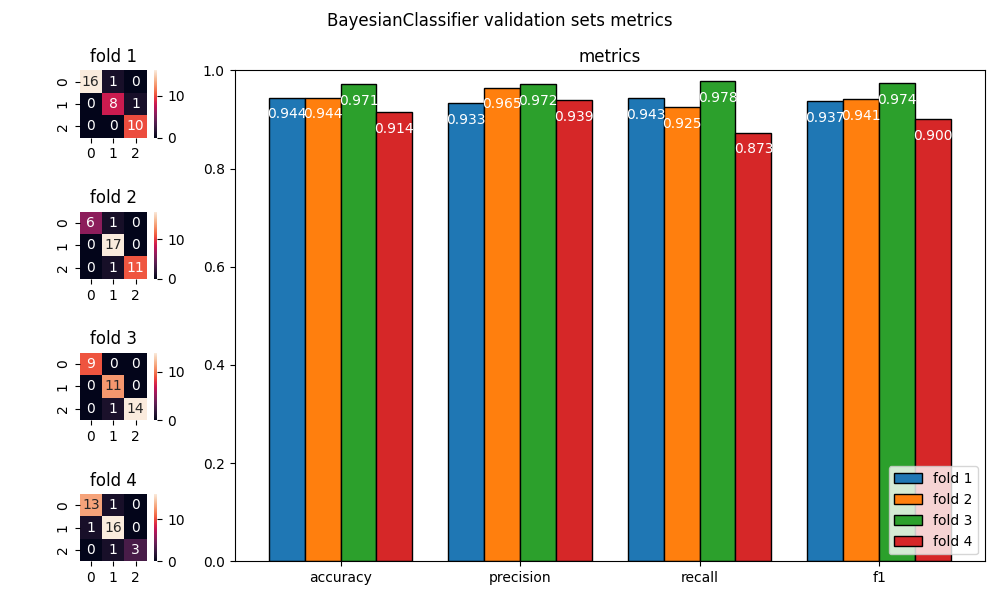
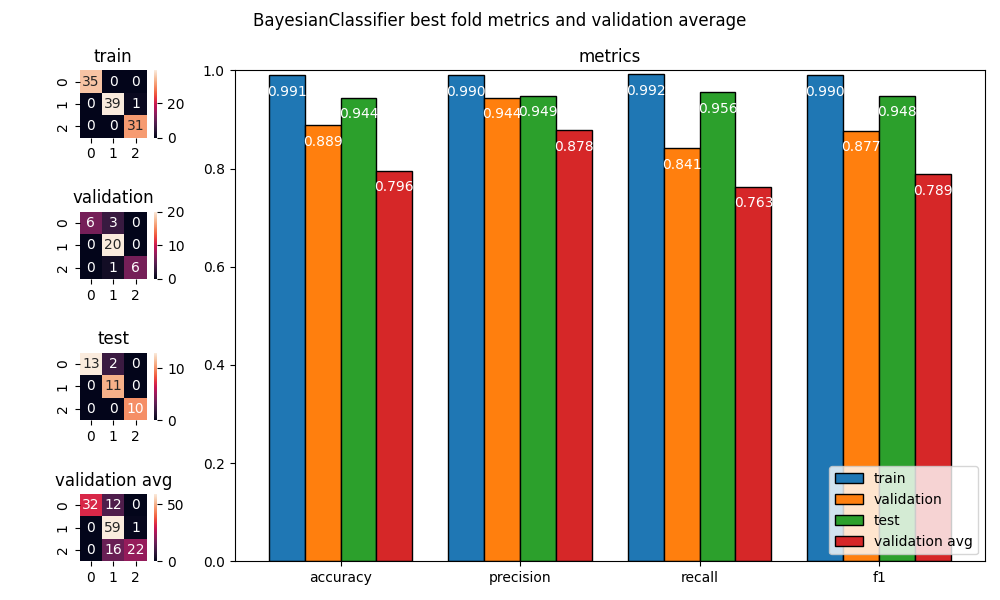

<h1 style="text-align: center;">

Jakub Ostrzołek

WSI ćwiczenie 7 - Modele bayesowskie

</h1>

## Opis ćwiczenia
Celem ćwiczenia była implementacja naiwnego klasyfikatora Bayesa.

Model ma następujące metody (zgodne z biblioteką `sklearn`):
* `fit(X, y)` - trenowanie modelu dla danych wejść X i spodziewanych wyjść y
* `predict(X)` - przewidywanie wyjść y dla danych wejść X za pomocą modelu

Aby klasyfikator dział dobrze, należy przed użyciem zdyskretyzować dane wejściowe

## Wykorzystane zewnętrzne biblioteki
* `numpy`
* `matplotlib`
* `sklearn`
* `pandas`

## Testowanie klasyfikatora
Aby przetestować klasyfikator należy wykonać skrypt `main.py`, uprzednio zmieniając jego parametry zgodnie z zapotrzebowaniem.  
Skrypt wygeneruje nowy model i wytrenuje go używając n-walidacji krzyżowej, a następnie wyświetli porównanie osiągów dla każdego podziału zbiorów. Na koniec zostaną pokazane osiągi najlepszego przebiegu (tego z najwyższą sumą metryk) dla zbioru testowego.

## Wykresy i wnioski

### Parametr `TEST_SIZE`
Parametr ten kontroluje jaka część zbioru wine jest przeznaczona na zbiór testowy.

`TEST_SIZE` | porównanie przebiegów krzyżowania | osiągi najlepszego przebiegu krzyżowania
-|-|-
0,1 |  | 
0,2 |  | 
0,3 |  | 
0,4 |  | 
0,5 |  | 

* zbyt duża wartość tego parametru zmniejsza osiągi modelu, ponieważ zawęża się liczność jak i różnorodność zbioru treningowego
* zbyt mała wartość może powodować większe wachania oceny modelu, przez co jest ona niepewna. Zjawisko to może występować w obie strony (zbyt optymistyczna lub zbyt pesymistyczna ocena). 

### Parametr `N_SPLITS`
Parametr ten kontroluje na ile równych części dzielony jest zbiór, który zostaje rozdysponowany na zbiór treningowy i walidacyjny (1 część na walidacyjny, reszta na treningowy).

`N_SPLITS` | porównanie przebiegów krzyżowania | osiągi najlepszego przebiegu krzyżowania
-|-|-
2 |  | 
3 |  | 
4 |  | 
5 |  | 
6 |  | 

* zbyt duża wartość parametru sprzyja przetrenowaniu
* zbyt mała wartość parametru sprzyja niedotrenowaniu
* może to być efekt zwiększania rozmiaru zbioru treningowego w porównaniu do zbioru walidacyjnego

### Parametr `N_BINS`
Parametr ten kontroluje ilość przedziałów w dyskretyzacji każdej kolumny danych wejściowych do klasyfikatora.

`N_BINS` | porównanie przebiegów krzyżowania | osiągi najlepszego przebiegu krzyżowania
-|-|-
2 |  | 
3 |  | 
5 |  | 
7 |  | 
10 |  | 

* zbyt duża wartość parametru sprzyja przetrenowaniu
* zbyt mała wartość parametru sprzyja niedotrenowaniu

